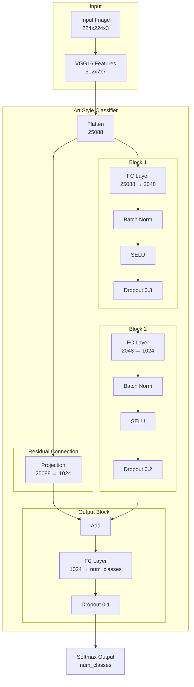

```mermaid
flowchart TB
    subgraph Input
        img[Input Image<br/>224x224x3]
        vgg[VGG16 Features<br/>512x7x7]
    end

    subgraph Classifier[Art Style Classifier]
        flat[Flatten<br/>25088]
        
        subgraph Block1[Block 1]
            fc1[FC Layer<br/>25088 → 2048]
            bn1[Batch Norm]
            selu1[SELU]
            drop1[Dropout 0.3]
        end
        
        subgraph Block2[Block 2]
            fc2[FC Layer<br/>2048 → 1024]
            bn2[Batch Norm]
            selu2[SELU]
            drop2[Dropout 0.2]
        end
        
        subgraph ResidualPath[Residual Connection]
            res[Projection<br/>25088 → 1024]
        end
        
        subgraph OutputBlock[Output Block]
            add[Add]
            fc3[FC Layer<br/>1024 → num_classes]
            drop3[Dropout 0.1]
        end
    end
    
    output[Softmax Output<br/>num_classes]
    
    %% Connections
    img --> vgg
    vgg --> flat
    
    %% Block 1 connections
    flat --> fc1
    fc1 --> bn1
    bn1 --> selu1
    selu1 --> drop1
    
    %% Block 2 connections
    drop1 --> fc2
    fc2 --> bn2
    bn2 --> selu2
    selu2 --> drop2
    
    %% Residual connection
    flat --> res
    res --> add
    drop2 --> add
    
    %% Output connections
    add --> fc3
    fc3 --> drop3
    drop3 --> output

    %% Styling
%%    classDef block fill:#f9f,stroke:#333,stroke-width:2px
%%    classDef operation fill:#bbf,stroke:#333,stroke-width:1px
%%    classDef input fill:#dfd,stroke:#333,stroke-width:2px
%%    classDef output fill:#fdd,stroke:#333,stroke-width:2px
    
    class Block1,Block2,OutputBlock block
    class fc1,fc2,fc3,bn1,bn2,selu1,selu2,drop1,drop2,drop3,add operation
    class img,vgg,flat input
    class output output
```