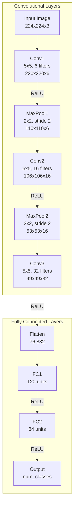

```mermaid
flowchart TB
    subgraph Convolutional Layers
        input["Input Image\n224x224x3"] --> conv1["Conv1\n5x5, 6 filters\n220x220x6"]
        conv1 --> |ReLU| pool1["MaxPool1\n2x2, stride 2\n110x110x6"]
        pool1 --> conv2["Conv2\n5x5, 16 filters\n106x106x16"]
        conv2 --> |ReLU| pool2["MaxPool2\n2x2, stride 2\n53x53x16"]
        pool2 --> conv3["Conv3\n5x5, 32 filters\n49x49x32"]
    end

    subgraph Fully Connected Layers
        flatten["Flatten\n76,832"] --> fc1["FC1\n120 units"]
        fc1 --> |ReLU| fc2["FC2\n84 units"]
        fc2 --> |ReLU| output["Output\nnum_classes"]
    end

    conv3 --> |ReLU| flatten
```